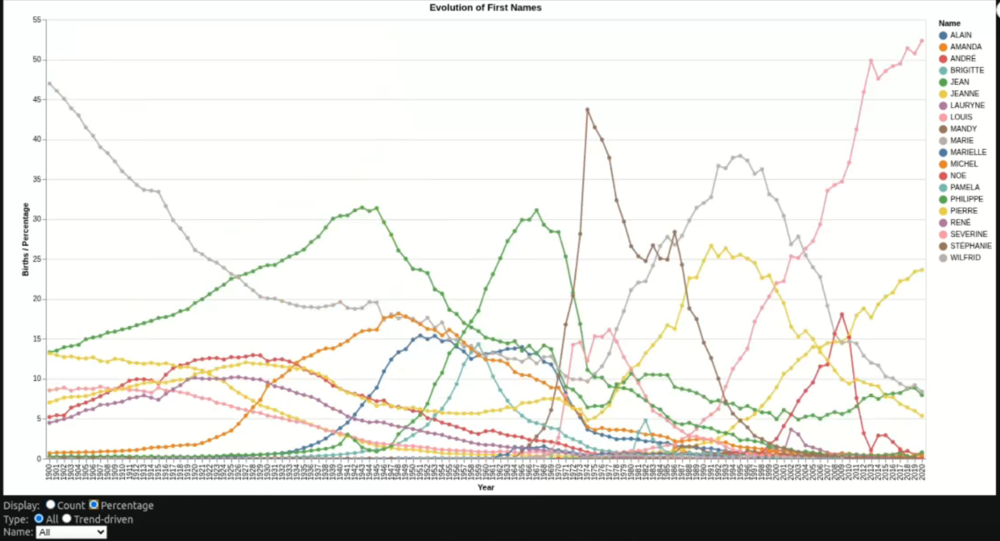
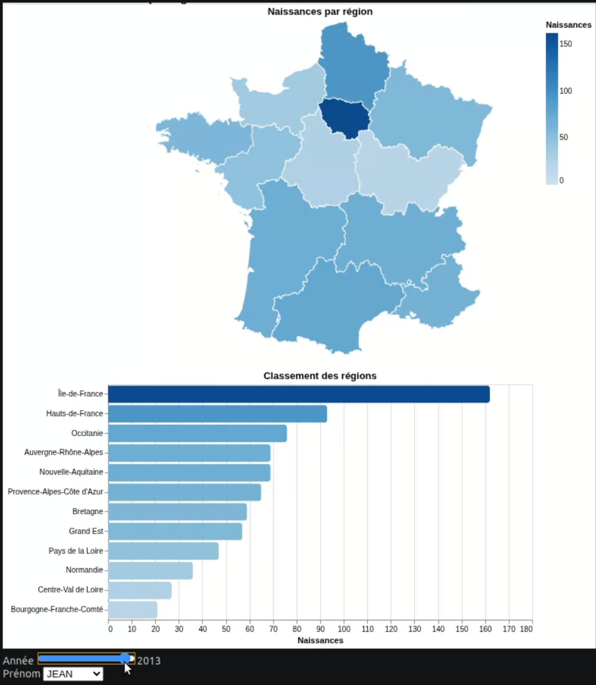
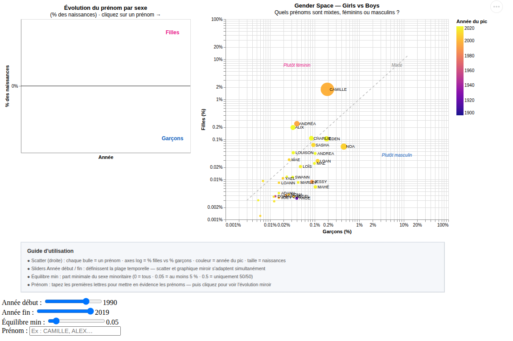

# Mini Project — Baby Names in France (1900–2020)

> IGR204 · Télécom Paris
> Dataset: INSEE — First names registered in metropolitan France by department, from 1900 to 2020.

---

## Context and Research Questions

The project aims to answer three main questions through interactive visualizations:

| #     | Research Question                                                                                                                         |
| ----- | ----------------------------------------------------------------------------------------------------------------------------------------- |
| **1** | How do first names evolve over time? Are some names consistently popular while others are short-lived trends?                             |
| **2** | Are there regional effects? Are some names popular only in specific regions? Are the most popular names equally widespread across France? |
| **3** | Are there gender-related effects? Do names given to both boys and girls evolve similarly over time?                                       |

---

## Visualization 1 — Temporal Evolution & Trend Effects

> **Research Question:** How do first names evolve over time? Can some names be identified as temporary trends?

**Notebook:** [visu1.ipynb](visu1.ipynb)

### Preview




### Description

Interactive line chart showing the evolution of the 10 most popular first names and names identified as **trend-driven names** (sharp popularity peak followed by a rapid decline).

| Control                          | Effect                                                |
| -------------------------------- | ----------------------------------------------------- |
| **Display Mode** (radio buttons) | Switch between number of births and annual percentage |
| **Type** (radio buttons)         | Display all names or only trend-driven names          |
| **First Name** (dropdown list)   | Isolate a specific name                               |


## Visualization 2 — Geographic Distribution by Region

> **Research Question:** Are there regional effects? Does the popularity of a name vary across regions?

**Notebook:** [Visu2.ipynb](Visu2.ipynb)

### Preview



### Description

Dashboard combining a choropleth map of France by region and a horizontal ranking of regions, updated in real time.

| Control                        | Effect                           |
| ------------------------------ | -------------------------------- |
| **Year** (slider 1900–2020)    | Updates both the map and ranking |
| **First Name** (dropdown list) | Select the name to explore       |


## Visualization 3 — Gender Space × Mirrored Evolution

> **Research Question:** Are there gender effects? Do names shared by girls and boys evolve similarly over time?

**Notebook:** [visu3.ipynb](visu3.ipynb)

### Preview



### Interactive Demonstration

The demonstration video is available here:

**[▶ Watch the interactive demonstration](img/visualisation3.mp4)**


### Description

The visualization consists of **two linked charts**:

#### Right Panel — Gender Space (log-log scatter plot)

Each bubble represents a first name. Its position on the logarithmic axes indicates its share among female births (Y-axis) and male births (X-axis) during the selected period.

* **Diagonal y = x**: balanced names — equally popular among both sexes
* **Above the diagonal**: predominantly female names
* **Below the diagonal**: predominantly male names
* **Color**: year of peak popularity (Plasma color scale)
* **Size**: total number of births during the selected period

#### Left Panel — Mirrored Evolution Chart

Selecting a name in the scatter plot displays its temporal evolution:

* **Pink (top)**: share of female births with that name
* **Blue (bottom)**: share of male births with that name (inverted axis)
* The chart automatically adapts to the selected year range

### Interactive Controls

| Control                             | Effect                                                                                                                                |
| ----------------------------------- | ------------------------------------------------------------------------------------------------------------------------------------- |
| **First Name** (text field)         | Highlights names starting with the entered letters in the scatter plot                                                                |
| **Start Year / End Year** (sliders) | Filters the time range; both charts update simultaneously                                                                             |
| **Minimum Balance** (slider 0–0.5)  | Minimum proportion of the minority sex: `0.05` = at least 5% of the other sex, `0` = all names, `0.5` = only perfectly balanced names |
| **Click on a bubble**               | Displays the mirrored evolution of the selected name                                                                                  |

---

## Installation and Execution

```bash
# Create the environment (Python 3.12)
uv venv
uv pip install altair pandas geopandas jupyter

# Activate the environment
source .venv/bin/activate

# Launch Jupyter
jupyter notebook
```

Then open either [visu1.ipynb](visu1.ipynb), [Visu2.ipynb](Visu2.ipynb), or [visu3.ipynb](visu3.ipynb) depending on the visualization you want to explore.

---

## Repository Structure

```text
├── Names_hints/
│   ├── dpt2020.csv                          # INSEE dataset (first name × department × year)
│   ├── departements-version-simplifiee.geojson
│   └── departements-avec-outre-mer.geojson
├── visu1.ipynb                              # Visualization 1 — Temporal evolution & trend effects
├── Visu2.ipynb                              # Visualization 2 — Regional map
└── visu3.ipynb                              # Visualization 3 — Gender Space × Mirrored evolution
```

---

## Dataset

* **Source:** INSEE — French First Names Dataset
* **Period:** 1900–2020
* **Granularity:** department × year × sex × first name
* **Columns:** `sexe` (1 = male, 2 = female), `preusuel`, `annais`, `dpt`, `nombre`
* Rare names (`_PRENOMS_RARES`) and unknown years (`XXXX`) are excluded from the analysis.
