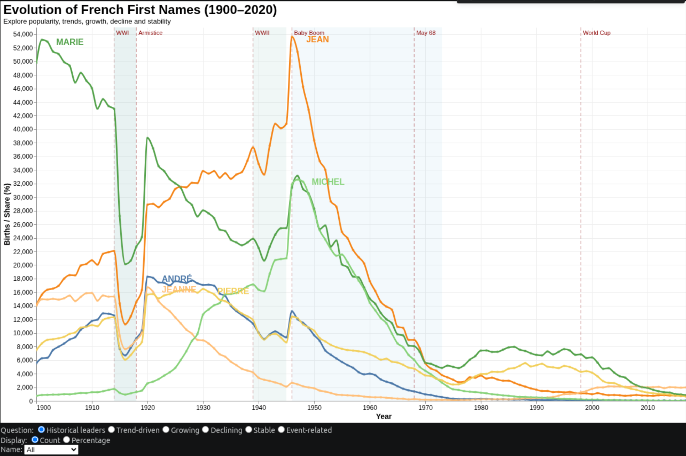
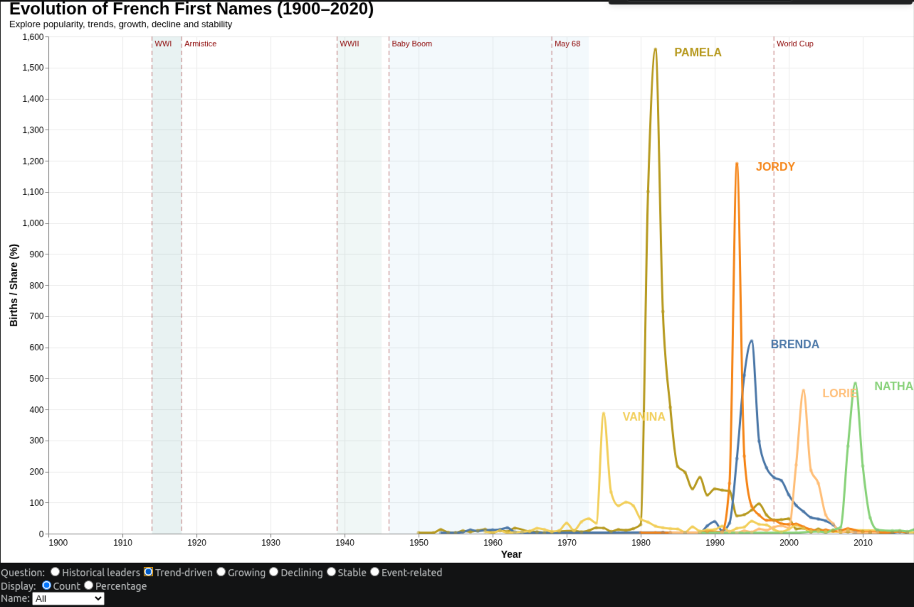
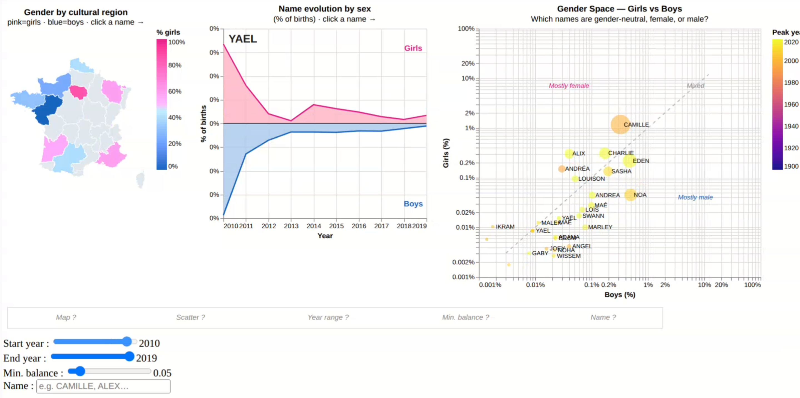

# Mini Project — Baby Names in France (1900–2020)

> IGR204 · Télécom Paris
> Dataset: INSEE — First names registered in metropolitan France by department, from 1900 to 2020.

---

## Context and Research Questions

The project aims to answer three main questions through interactive visualizations:

| #     | Research Question                                                                                                                         |
| ----- | ----------------------------------------------------------------------------------------------------------------------------------------- |
| **1** | How do first names evolve over time? Are some names consistently popular while others are short-lived trends?                             |
| **2** | Are there regional effects? Are some names popular only in specific regions? Are the most popular names equally widespread across France? |
| **3** | Are there gender-related effects? Do names given to both boys and girls evolve similarly over time?                                       |

---

## Visualization 1 — Temporal Evolution & Trend Effects

> **Research Question:** How do first names evolve over time? Can some names be identified as temporary trends?

**Notebook:** [visu1.ipynb](visu1.ipynb)

### Preview




### Description

This interactive visualization shows how the popularity of French first names evolved between 1900 and 2020, either in absolute numbers of births or as a percentage of all births in a given year. It allows users to explore and compare historically popular, trend-driven, growing, declining, stable, and event-related names while highlighting potential links between naming patterns and major historical events.

### Questions Answered by the Visualization

**Historical Popularity**

* Which names have been the most popular in France over the period 1900–2020?
* How has the popularity of historically dominant names changed over time?

**Trend-Driven Names** (effet de mode)

* Which names experienced short-lived popularity spikes?
* Which names were strongly associated with specific periods or generations?

**Growing Names**

* Which names have shown sustained growth in recent decades?

**Declining Names**

* Which names were popular in the past but are uncommon today?

**Stable Names**

* Which names have maintained relatively consistent popularity across generations?

**Event-Related Names**

* Do major historical events coincide with changes in the popularity of certain names?
* Do names associated with public figures, athletes, or celebrities experience popularity surges after notable events?

**Comparisons**

* How do different names compare across the same time period?
* Do observed trends change when popularity is measured as percentages rather than absolute birth counts?
* Which names dominate a given period relative to other categories of names?


---

## Visualization 2 — Geographic Distribution by Region

> **Research Question:** Are there regional effects? Does the popularity of a name vary across regions?

**Notebook:** [Visu2.ipynb](Visu2.ipynb)

### Preview


### Description

This interactive choropleth map explores the geographical distribution of first names across France. For any selected name and year, regions are colored according to their level of representation relative to the national average. The visualization uses a normalized index, where **1 indicates the national average**, values above 1 indicate **overrepresentation**, and values below 1 indicate **underrepresentation**. Users can interact with the map to investigate regional naming preferences and access more detailed department-level information.

### Questions Answered by the Visualization

**Regional Effects**

* Is there a regional effect in the distribution of first names across France?
* Which regions exhibit naming patterns that differ significantly from the national average?

**Regional Popularity**

* Which first names are overrepresented or underrepresented in specific regions?
* How does the geographic concentration of a name change over time?

**Local vs National Trends**

* To what extent does local popularity reflect national popularity?
* Are some names nationally common but regionally concentrated?

**Spatial Comparisons**

* How do different regions compare in their preference for a given name?
* Which areas show the strongest deviations from national naming patterns?

### Improvements Compared to the Previous Version

Several enhancements were implemented to improve readability and interpretation:

* Regional values are now normalized using shares rather than raw birth counts, making comparisons more meaningful.
* The legend has been simplified to make regional rankings easier to interpret.
* A reference line at index 1 clearly identifies the national average.
* Clicking on a region provides access to department-level details for deeper exploration.


| Control                        | Effect                           |
| ------------------------------ | -------------------------------- |
| **Year** (slider 1900–2020)    | Updates both the map and ranking |
| **First Name** (dropdown list) | Select the name to explore       |

---

## Visualization 3 — Gender Space × Mirrored Evolution

> **Research Question:** Are there gender effects? Do names shared by girls and boys evolve similarly over time?

**Notebook:** [visu3.ipynb](visu3.ipynb)

### Preview



### Description

This interactive dashboard combines three coordinated views to explore how first names given to both sexes evolve across time, gender, and geography. The **Gender Space** scatter plot positions each mixed-gender name according to its popularity among girls and boys, with bubble size representing total births and color indicating the year of peak popularity. Selecting a name updates a **mirrored area chart**, showing its evolution separately for each sex, and a **cultural regions map**, highlighting whether the name is more frequently associated with boys or girls across different cultural regions of France. Users can adjust time sliders to focus on specific periods and observe how naming patterns change over time.

### Questions Answered by the Visualization

**Gender Effects**

* Do names given to both sexes exhibit gender-specific popularity patterns?
* How strongly is each mixed-gender name associated with boys or girls?

**Evolution Through Time**

* Does the popularity of a mixed-gender name evolve consistently across sexes?
* Do some names switch from being predominantly male to predominantly female, or vice versa?

**Regional Gender Differences**

* Do gender associations for a given name vary across cultural regions?
* Which regions display the strongest male or female preference for a name?

**Comparisons Between Names**

* Which names are nearly gender-balanced and which are strongly gendered?
* How do different mixed-gender names compare in terms of popularity, gender balance, and historical trajectory?

**Temporal Dynamics**

* How do gender patterns change when focusing on different time periods?
* Can the same name move from one gender-dominated category to another across generations?

### Key Insights Highlighted by the Visualization

* Gender effects are the norm rather than the exception: very few names lie close to the equality line where male and female popularity are identical.
* Some names undergo substantial gender shifts over time. For example, **DOMINIQUE** transitions from predominantly male before the 1960s to predominantly female afterward, while **CLAUDE** remains comparatively balanced across the century.
* The cultural-regions map dynamically recomputes gender ratios for the selected time window, allowing users to observe how regional gender preferences evolve through time.

### Improvements Compared to the Previous Version

Several modifications were introduced to strengthen the analytical value of the dashboard:

* A new cultural-regions map was added to complement the gender and temporal analyses.
* Regional gender ratios are now recalculated dynamically for the selected period instead of displaying static all-time averages.
* The dashboard opens with the main research question and a note regarding the binary sex classification used in the dataset.
* Suggested names are provided to encourage exploration of notable gender-transition cases.


The visualization consists of **3 linked charts**:

#### Right Panel — Gender Space (log-log scatter plot)

Each bubble represents a first name. Its position on the logarithmic axes indicates its share among female births (Y-axis) and male births (X-axis) during the selected period.

* **Diagonal y = x**: balanced names — equally popular among both sexes
* **Above the diagonal**: predominantly female names
* **Below the diagonal**: predominantly male names
* **Color**: year of peak popularity (Plasma color scale, 1900 → yellow, 2020 → pink)
* **Size**: total number of births during the selected period

#### Left Panel — Mirrored Evolution Chart

Selecting a name in the scatter plot displays its temporal evolution:

* **Pink (top)**: share of female births with that name
* **Blue (bottom)**: share of male births with that name (inverted axis)
* The chart automatically adapts to the selected year range

### How it answers the research question

The visualisation answers the question in two complementary steps:

**1 — Gender Space scatter: snapshot of asymmetry**
A name whose popularity evolves *consistently* across sexes would stay near the diagonal y = x regardless of the year range. In practice almost every bubble drifts away from it — gender effects exist.

**2 — Mirror chart: temporal consistency**
Clicking a name and sliding the year range reveals whether the girls/boys ratio has been stable over time:

| Name | What the mirror shows | Interpretation |
|------|-----------------------|----------------|
| **CAMILLE** | Female area swells from the 1970s; male area nearly flat | Popularity rose sharply for girls but not boys — **inconsistent** evolution |
| **ALEX** | Near-symmetric mirror, stable across the century | Similar popularity in both sexes — **consistent** evolution |
| **DOMINIQUE** | Male-dominant before ~1970, female-dominant after | A full "side switch" — gender effect present *and* reversed over time |

**3 — Sliders as epoch comparison**
Restricting the range to 1950–1970 then 1990–2010 on the same name shows whether an imbalance is recent or historical.

> **Note:** the visualisation shows temporal correlation, not causation. The INSEE sex = 1 / 2 categories are a binary simplification that does not reflect the full spectrum of gender identities.

### Interactive Controls

| Control                             | Effect                                                                                                                                |
| ----------------------------------- | ------------------------------------------------------------------------------------------------------------------------------------- |
| **Name** (text field)               | Highlights names starting with the entered letters in the scatter plot                                                                |
| **Start Year / End Year** (sliders) | Filters the time range; both charts update simultaneously                                                                             |
| **Min. balance** (slider 0–0.5)     | Minimum share of the minority sex: `0.05` = at least 5% · `0` = all names · `0.5` = 50/50 only |
| **Click on a bubble**               | Displays the mirrored evolution of the selected name                                                                                  |

### Design choices

**Why a log-log scatter?**
Name popularity follows a highly skewed distribution. The logarithmic scale makes both very popular names (CAMILLE, ALEX) and rarer ones visible without the former overwhelming the latter.

**Why a mirrored area chart?**
Overlaying two lines on the same axis makes comparison difficult for asymmetric names (e.g. CAMILLE: 70% female). The mirror guarantees a symmetric, immediate reading of the female/male ratio.

**Why link the two charts by click?**
The scatter gives a global view of the mixed-name space at a given moment; the mirror chart adds the temporal dimension for a specific name. Linking by click avoids the visual overload of showing all evolutions simultaneously.

**Why the balance filter?**
Without filtering, highly asymmetric names (99% female) crowd the scatter and hide truly mixed names. The slider lets users zoom progressively onto shared names.


## Installation and Execution

```bash
# Create the environment (Python 3.12)
uv venv
uv pip install altair pandas geopandas jupyter

# Activate the environment
source .venv/bin/activate

# Launch Jupyter
jupyter notebook
```

Then open either [visu1.ipynb](visu1.ipynb), [Visu2.ipynb](Visu2.ipynb), or [visu3.ipynb](visu3.ipynb) depending on the visualization you want to explore.

---

## Repository Structure

```text
├── Names_hints/
│   ├── dpt2020.csv                          # INSEE dataset (first name × department × year)
│   ├── departements-version-simplifiee.geojson
│   └── departements-avec-outre-mer.geojson
├── visu1.ipynb                              # Visualization 1 — Temporal evolution & trend effects
├── Visu2.ipynb                              # Visualization 2 — Regional map
├── visu3.ipynb                              # Visualization 3 — Gender Space × Mirrored evolution
├── visualisation3.html                      # Interactive HTML export (visu 3)
├── visualisation3.png                       # Screenshot (visu 3)
└── Visualisation3.mp4                       # Demonstration video (visu 3)
```

---

## Dataset

* **Source:** INSEE — [French First Names Dataset](https://www.data.gouv.fr/fr/datasets/fichier-des-prenoms-edition-2016/)
* **Period:** 1900–2020
* **Granularity:** department × year × sex × first name
* **Columns:** `sexe` (1 = male, 2 = female), `preusuel`, `annais`, `dpt`, `nombre`
* Rare names (`_PRENOMS_RARES`) and unknown years (`XXXX`) are excluded from the analysis.
